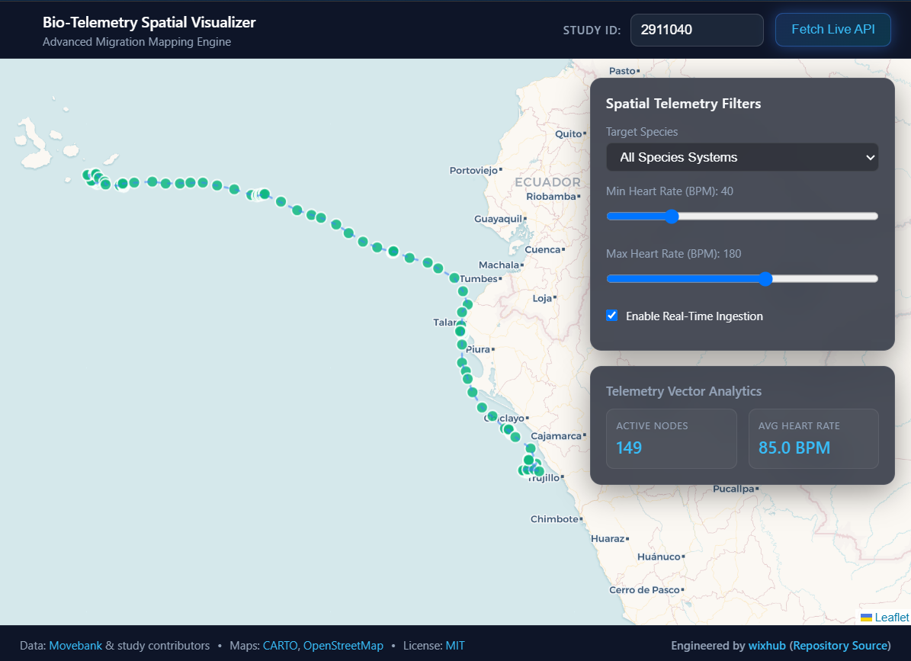

# 🧬 Bio-Telemetry Spatial Visualizer

The spatial rendering engine for migratory animal tracking data, engineered for ecological metadata management and reactive spatial filtering. A high-performance Angular dashboard designed to visualize biological telemetry data from the **Movebank API**, built as a reactive, user-friendly replacement for legacy tracking interfaces.

---

## 🏛️ Architecture Overview

The application is built as an enterprise-grade Angular single-page application leveraging architecture (Signals, RxJS and standalone components) alongside Leaflet for spatial mapping. It utilizes zoneless change detection to maximize frame-rate performance for high-frequency Leaflet GIS canvas rendering and real-time telemetry streaming.

---

## ⚡ Key Technical Pillars

- **Signals & Computed Reactivity**: Fine-grained state synchronization using Angular Signals (`signal`, `computed`, `effect`) and seamless RxJS bridging via `toSignal()`.

- **Standalone Components**: Strict modular standalone architecture optimized with lazy-loaded deferrable views (`@defer (on idle)`).

- **GIS Map Encapsulation**: Decoupled Leaflet integration managed via enterprise services with rigorous `DestroyRef` memory cleanup lifecycles.

---

## 🚀 Live Demo

🔗 **[View Live Application on Cloudflare Pages](https://bio-stream.pages.dev)**



---

## 🌐 Data Source & Backend Proxy

- **Cloudflare Worker Integration**: The application utilizes a dedicated serverless worker as an online data source and API proxy. It securely fetches live telemetry streams from the Movebank API, handles CORS limitations and parses raw CSV responses into strongly-typed data models.

- **Backend Endpoint**: 🔗 **[View Worker on Cloudflare Workers](https://wispy-surf-c9db.rublin.workers.dev/)**

- **Data Attribution**: Telemetry data is accessed via the **[Movebank API](www.movebank.org)** and provided by individual study contributors. Map tiles are powered by **CARTO** under CC BY 3.0, utilizing data from **OpenStreetMap** contributors.

---

## 🌟 Key Features

- **Interactive Leaflet Mapping**: Real-time rendering of spatial coordinates, color-coded species markers and movement tracking polylines.

- **Dual Data Sources**: Seamlessly switch between local static mock data (`telemetry-mock.json`) and live telemetry feeds from Movebank via a custom Cloudflare Worker proxy (`wispy-surf-c9db.rublin.workers.dev`).

- **Multi-Study Support**: Easily toggle between public research studies (e.g., Northern Elephant Seals, Galapagos Albatrosses, Galapagos Tortoises) right from the UI HUD.

- **Robust Error Handling & Fallbacks**: Automated fallback mechanisms if upstream Movebank API requests experience timeouts or rate limits (HTTP 522 Cloudflare errors).

- **Advanced Filtering & Analytics**: Filter streams dynamically by species classifications (`AVIAN_MIGRATORY`, `MARINE_CETACEAN`, `TERRESTRIAL_UNGULATE`) and physiological thresholds (Heart Rate ranges).

---

## 🛠️ Core Services & Components

- **`LeafletMapService`**: Manages the Leaflet map lifecycle, layer groups, custom circle markers, popups and polyline vectors.

- **`TelemetryStreamService`**: Handles HTTP communication with the Cloudflare Worker proxy, CSV parsing into strongly-typed telemetry models and fallback logic.

- **`MapContainer`**: The master orchestration container combining HUD controls, reactive stream routing and analytics components.

## Project Structure

```text
bio-stream/
    ├── public/
    │ └── data/
    │ └── telemetry-mock.json
    ├── src/
    │ ├── app/
    │ │ ├── core/
    │ │ │ ├── models/
    │ │ │ │ └── telemetry.model.ts
    │ │ │ └── services/
    │ │ │ ├── leaflet-map.service.ts
    │ │ │ └── telemetry-stream.service.ts
    │ │ ├── features/
    │ │ │ ├── map-container/
    │ │ │ │ ├── map-container.component.ts
    │ │ │ │ ├── map-container.component.html
    │ │ │ │ └── map-container.component.scss
    │ │ │ ├── telemetry-filters/
    │ │ │ │ ├── telemetry-filters.component.ts
    │ │ │ │ ├── telemetry-filters.component.html
    │ │ │ │ └── telemetry-filters.component.scss
    │ │ │ └── telemetry-analytics/
    │ │ │ ├── telemetry-analytics.component.ts
    │ │ │ ├── telemetry-analytics.component.html
    │ │ │ └── telemetry-analytics.component.scss
    │ │ ├── app.config.ts
    │ │ ├── app.ts
    │ │ └── app.html
    │ ├── styles.scss
    │ └── main.ts
    ├── angular.json
    ├── package.json
    └── README.md
```

## Getting Started

Prerequisites

- Node.js (v20+ recommended)
- Angular CLI (v22+)

## Installation & Development

Clone the repository and install dependencies:

```bash
git clone https://github.com/wixhub/bio-stream.git
cd bio-stream
npm install
```

## Development server

To start a local development server, run:

```bash
ng serve
```

Once the server is running, open your browser and navigate to `http://localhost:4200/`. The application will automatically reload whenever you modify any of the source files.

## Code scaffolding

Angular CLI includes powerful code scaffolding tools. To generate a new component, run:

```bash
ng generate component component-name
```

For a complete list of available schematics (such as `components`, `directives` or `pipes`), run:

```bash
ng generate --help
```

## Building

To build the project run:

```bash
ng build
```

This will compile your project and store the build artifacts in the `dist/` directory. By default, the production build optimizes your application for performance and speed.

## 🧪 Testing Suite

The application features comprehensive unit test coverage written for **Vitest** with mocked dependencies for Leaflet and HttpClient (`provideHttpClientTesting`).

## Running unit tests

To execute unit tests with the [Vitest](https://vitest.dev/) test runner, use the following command:

```bash
ng test
# or using vitest directly
npm run test
```

## Running end-to-end tests

For end-to-end (e2e) testing, run:

```bash
ng e2e
```

Angular CLI does not come with an end-to-end testing framework by default. You can choose one that suits your needs.

## Additional Resources

For more information on using the Angular CLI, including detailed command references, visit the [Angular CLI Overview and Command Reference](https://angular.dev/tools/cli) page.

## ⚖️ License & Attribution

- **Software License**: This project is open-source software licensed under the **[MIT License](./LICENSE)**.

- **Data & Map Attribution**:

  - Animal tracking data provided by **[Movebank](www.movebank.org)** and individual researchers.

  - Map tiles by **CARTO**, under CC BY 3.0. Data by **OpenStreetMap** contributors.
