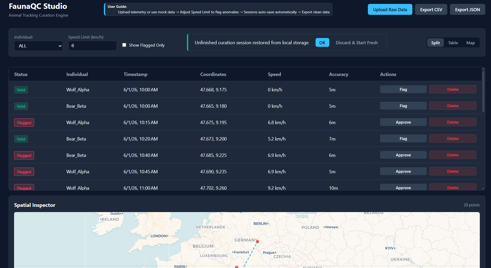

# FaunaQC Studio <br/> Movebank Data Curation & Quality Control Tool

An interactive, high-performance web application built with Angular 22 (Signals/Effects) designed to help researchers inspect, clean and validate raw animal tracking data prior to analysis or repository publication.

## Features

- **Granular Geospatial QC Engine**: Calculates movement metrics independently per animal (GeospatialQcEngine), preventing cross-individual speed calculation errors and flagging physical anomalies or GPS inaccuracies.

- **Session Auto-Save & Restoration**: Automatically persists curation state, manual overrides, and filter configurations to IndexedDB via Dexie.js, complete with an integrated session restoration workflow.

- **Deterministic Map Visualization**: Integrates Leaflet.js to render segmented paths with distinct, consistent color-coding per animal subject alongside interactive popup telemetry inspectors.

- **Adaptive UI & Layout**: Utilizes SCSS and CSS Grid to transform split-screen data management tools into fluid, mobile-friendly interfaces across devices.

- **Interactive Review & Export**: Visually inspect anomalies, toggle data inclusion status via manual overrides, and export cleaned datasets locally as CSV or JSON formats.

## Tech Stack

- **Framework:** This project was generated using [Angular CLI](https://github.com/angular/angular-cli) version 22.1.3 (Signals, Effects, Functional Inputs/Outputs)

- **Persistence**: Dexie.js (IndexedDB)

- **Styling:** SCSS, CSS Grid (Fully Responsive Across All Screens)

- **Mapping & Logic:** Leaflet.js with CARTO basemaps integration, custom data-processing pipes



### User Guide:

1. Upload a raw telemetry dataset using **Upload Raw Data** or inspect the preloaded mock records.
2. Adjust the **Speed Limit** to automatically flag physical anomalies, review points in the table or spatial inspector.
3. Your session is **auto-saved**, allowing you to seamlessly continue editing after a reload.
4. Export your cleaned dataset for repository publication.

## Getting Started

```bash
git clone https://github.com/wixhub/data-curation.git

cd data-curation
```

## ⚙️ Configuration & Environment

To run this application locally, you need to provide configuration keys for map tiles [CARTO](https://carto.com/basemaps/apikey/).

1. Copy the example environment configuration file located in `src/environments/`:

```bash
cp src/environments/environment.example.ts src/environments/environment.ts
```

2. Open src/environments/environment.ts and insert your personal CARTO API key:

```typescript
export const environment = {
  production: true,
  cartoApiKey: 'YOUR_CARTO_API_KEY',
};
```

> [!NOTE]
> `environment.ts` is ignored by Git to keep API keys secure, while `environment.example.ts` serves as the public template.

## Development server

To start a local development server, run:

```bash
ng serve
```

Once the server is running, open your browser and navigate to `http://localhost:4200/`. The application will automatically reload whenever you modify any of the source files.

## Code scaffolding

Angular CLI includes powerful code scaffolding tools. To generate a new component, run:

```bash
ng generate component component-name
```

For a complete list of available schematics (such as `components`, `directives`, or `pipes`), run:

```bash
ng generate --help
```

## Building

To build the project run:

```bash
ng build
```

This will compile your project and store the build artifacts in the `dist/` directory. By default, the production build optimizes your application for performance and speed.

## Running unit tests

To execute unit tests with the [Vitest](https://vitest.dev/) test runner, use the following command:

```bash
ng test
```

## Running end-to-end tests

For end-to-end (e2e) testing, run:

```bash
ng e2e
```

Angular CLI does not come with an end-to-end testing framework by default. You can choose one that suits your needs.

## Additional Resources

For more information on using the Angular CLI, including detailed command references, visit the [Angular CLI Overview and Command Reference](https://angular.dev/tools/cli) page.

## ⚖️ License & Attribution

- **Software License**: This project is open-source software licensed under the **[MIT License](./LICENSE)**.

- **Map Attribution**:

  - Map tiles by **CARTO**, under CC BY 3.0. Data by **OpenStreetMap** contributors.
